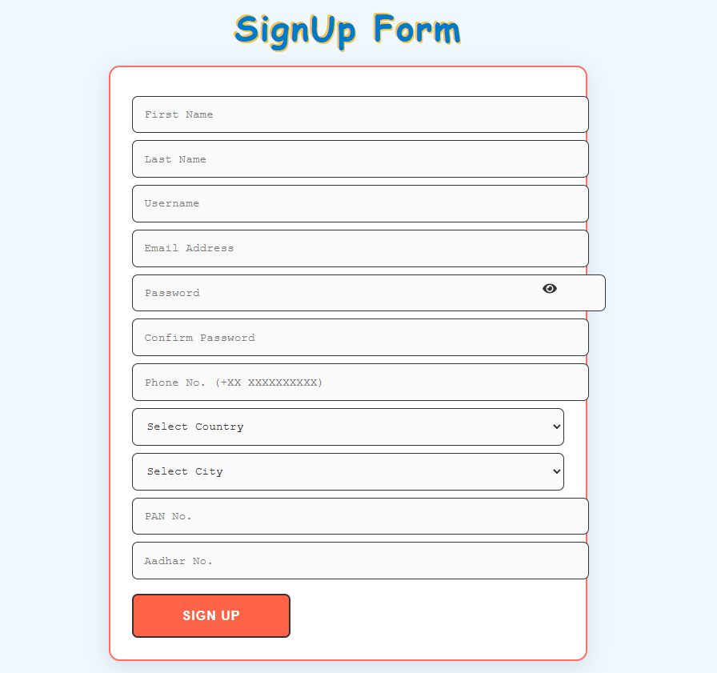
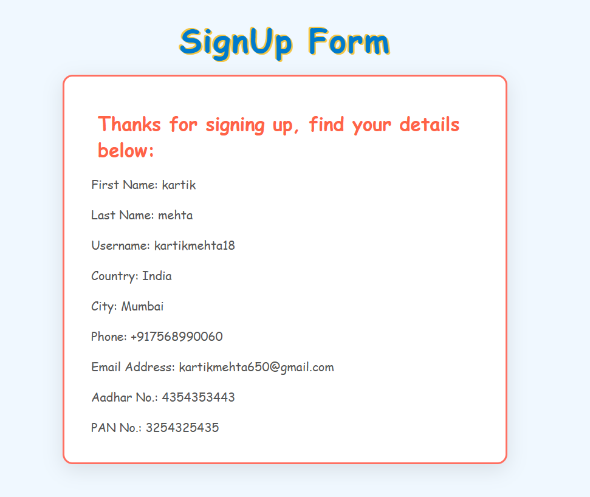

# Assing ment 1
Forms and Form Validation
Create a React form with validation for required fields without using third party libraries, Display error messages, disable submission until fields are filled correctly, and show all the filled details on a new route post-successful submission. Fields required: First Name, Last Name, Username, E-mail, password (show/hide), PhoneNo. (country code ____ number), country (dropdown), city (dropdown), Pan No. & Aadhar No.

